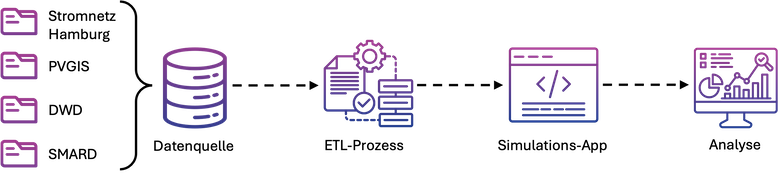
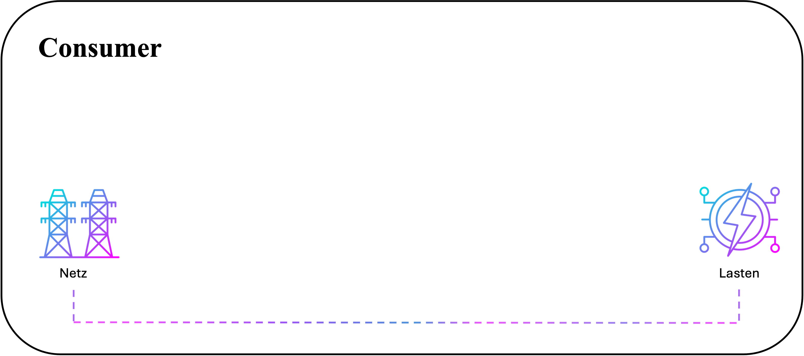
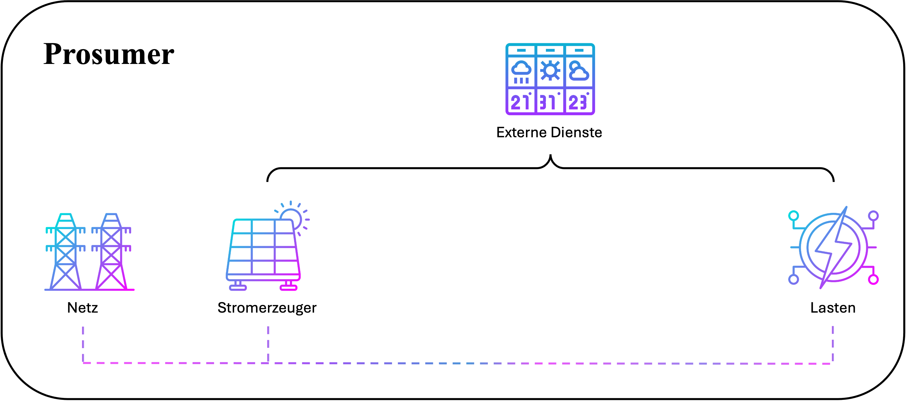
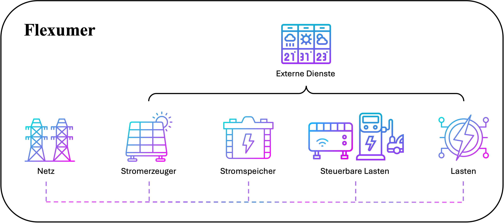
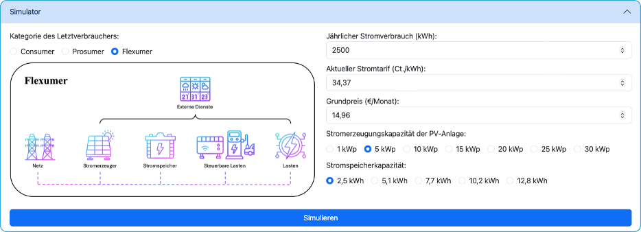
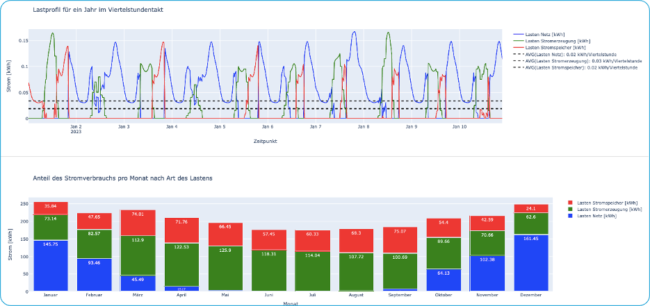

# Smart Grid Strategist (SGS)
Die Anwendung Smart Grid Strategist (SGS) dient als Forschungsgrundlage zur Untersuchung des Potenzials dynamischer Stromtarife für Haushalte. SGS wurde im Rahmen der Bachelorarbeit "Effizientes Energiemanagement in deutschen Haushalten: Potenzialanalyse durch Integration von Smart-Meter-Daten und maschinellem Lernen im Kontext dynamischer Tarifmodelle" entwickelt.

Ziel der Studie ist es, zu analysieren, wie Haushalte von dynamischen Stromtarifen profitieren können. Die Forschungsmethode nutzt Simulationen des Stromverbrauchs von Haushalten über einen bestimmten Zeitraum und ermöglicht deren Analyse mithilfe von Grafiken.

SGS bietet einen umfassenden Überblick über den Stromverbrauch in Haushalten und unterstützt die Nutzer dabei, ihr individuelles Verbrauchsverhalten zu verstehen sowie Einspar- und Optimierungspotenziale zu identifizieren.

## Funktionsweise des Programms
Das Programm besteht aus vier Modulen:

1. `Datenquelle`:  Das Datenquellenmodul enthält Dateien aus den Datenbanken "Hamburger Stromnetz", "PVGIS", "DWD" und "SMARD".
   
3. `ETL-Prozess`: Dieses Modul ist für das Extrahieren, Transformieren und Laden von Daten aus dem Datenquellenmodul zuständig. Nach dem ETL-Prozess dienen die verarbeiteten Daten als Referenzparameter für die Simulationen.
   
4. `Simulations-App`: In diesem Modul werden die im ETL-Prozess verarbeiteten Daten übertragen und für die Simulationen verwendet. Die Simulations-App ermöglicht es dem Nutzer, einige Parameter einzustellen, die die Simulationsergebnisse beeinflussen, wie z. B. den jährlichen Stromverbrauch eines Haushalts und die kWp einer PV-Anlage. Die Simulationsergebnisse werden an die nächste Phase zur Analyse weitergeleitet.
   
6. `Analyse`: Dieses Modul generiert verschiedene Charts mit den Simulationsdaten, mit denen der Nutzer die Simulationsergebnisse besser analysieren und bewerten kann.

  

## Eigenschaften der Simulationen

- **Simulator:** Die Anwendung verfügt über einen Simulator, der drei Kategorien von Endverbrauchern umfasst: Consumer, Prosumer und Flexumer. Jede Kategorie hat spezifische Merkmale, die es ermöglichen, ihr Verhalten in verschiedenen Szenarien zu simulieren.
- **Analysegrafiken:** Die Ergebnisse der Simulationen werden in klaren und visuellen Grafiken präsentiert, um die Analyse der komplexen Beziehungen zwischen den Variablen zu erleichtern.
- **Machine Learning-Vorhersagen:** Es werden maschinelles Lernen verwendet, um das Verhalten der simulierten Variablen vorherzusagen und mögliche Trends für das laufende Jahr aufzuzeigen.
## Simulationsszenarien
Die Simulationen umfassen drei Kategorien von Letztverbrauchern:
1. `Consumers`: Traditionelle Stromverbraucher, die Strom aus dem Netz abnehmen.
<p1 align="center">
  
</p1>

2. `Prosumers`: Stromverbraucher, die gleichzeitig Strom erzeugen und verbrauchen. In den Forschungsszenarien ist diese Kategorie mit Photovoltaikanlagen und ohne Batterien ausgestattet. Das heißt, ohne die Möglichkeit, Strom zu speichern.
<p1 align="center">
  
</p1>

3. `Flexumers`: Stromverbraucher, die gleichzeitig Strom erzeugen und verbrauchen. In den Forschungsszenarien ist diese Kategorie mit Photovoltaikanlagen und Batterien ausgestattet. Das heißt, mit der Möglichkeit, Strom zu speichern. Diese Kategorie ist außerdem mit zwei Stromverbrauchskomponenten ausgestattet, die über ein Überwachungssystem gesteuert werden können.
   
<p1 align="center">
  
</p1>

## Verwendung

**1. Simulator:** Wählen Sie den Typ des Endverbrauchers aus und passen Sie die Parameter bei Bedarf an, wie z. B. den jährlichen Stromverbrauch, den aktuellen Tarif, die Kapazität der Solarenergieerzeugung usw. Klicken Sie dann auf die Schaltfläche "Simulieren", um die Ergebnisse anzuzeigen.

<p1 align="center">
  
</p1>

**2. Analyse:** Erkunden Sie die generierten Grafiken, um den Stromverbrauch, die Stromerzeugung, die Energiepreise und mehr besser zu verstehen.

<p1 align="center">
  
</p1>

## Installation

1. Klone dieses Repository: `git clone https://github.com/acs340/smart-grid-strategist.git`
2. Installiere die Abhängigkeiten: `pip install -r requirements.txt`
3. Starte die Anwendung: `python app.py`
## Verwendete Technologien

- Python
- Dash (Framework zur Erstellung interaktiver Web-Benutzeroberflächen)
- Plotly (Bibliothek zur Erstellung interaktiver Grafiken)
## Autor

Mario Emanuel Fernández

## Lizenz

Dieses Projekt steht unter der `AFL-3.0`-Lizenz.
